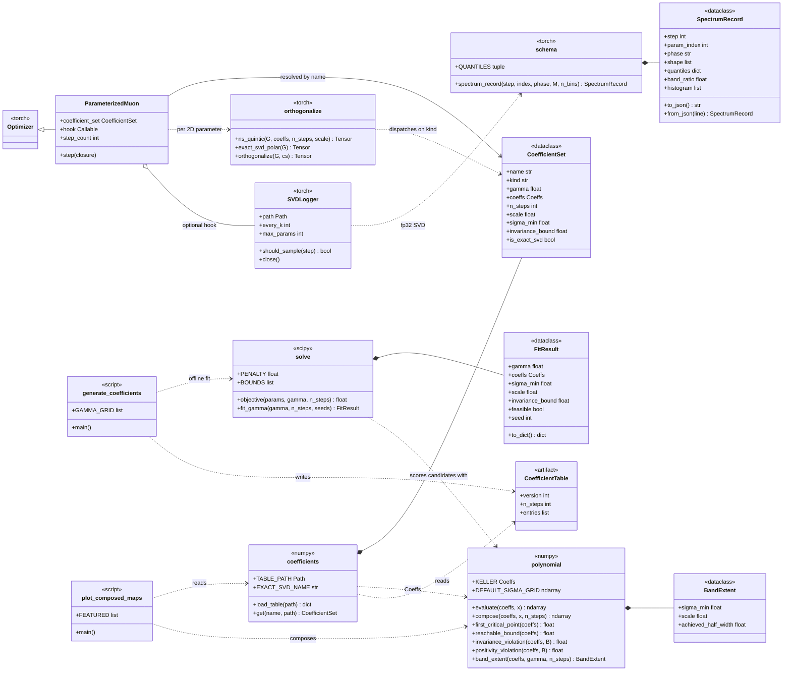

# nsshape — Newton–Schulz polynomial shaping for Muon

Does the Muon optimizer work well *because* its Newton–Schulz iteration
approximates the polar factor, or because of the particular **shape** it imposes
on the singular-value spectrum?

Muon's quintic was tuned for speed, not accuracy. It does not converge to the
polar factor at all — it drives singular values into a wide band. **H1:** that
band shape is the operative quantity, and shapes other than "as close to exact
polar as possible" may train better. If H1 fails, the result is a rigorous
defense of geometric alignment instead. Either outcome is publishable.

This repository covers stages 1–2: the verified coefficient family and the
instrumented optimizer. The CIFAR sweep and the transformer confirmation build on
the committed table.

## The γ family

One-parameter family of odd quintics `P(x) = ax + bx³ + cx⁵`, composed **N = 5**
times so every member is exactly compute-matched. For each γ:

```
minimize    σ_min
over        a, b, c
subject to  relhw( C([σ_min, 1]) ) ≤ γ            (band)
            reachable_bound(P) < ∞                 (bounded iteration)
            P(x) > 0  on (0, B]                    (positivity)

where       relhw(S) = (max S − min S) / (max S + min S)
            C = P∘P∘P∘P∘P
```

γ is the band half-width; σ_min is the smallest input singular value the map
still pulls into the band. A wider band buys the ability to lift near-zero
singular values within a fixed step budget — that is the real tradeoff Muon
makes, and the axis this ablation sweeps.

## Three constraints that are load-bearing

Each of these looks like an unnecessary complication until you hit the failure it
prevents. All three were established empirically; the naive version fails.

**The band is relative, not absolute.** A polynomial emitting every singular
value at 0.7 is the *same optimizer* as one emitting 1.0 with a 1.43× smaller
learning rate — the scale is absorbed by η. Using absolute deviation from 1
confounds γ with η and turns the 2D sweep into a diagonal. Relative half-width is
scale-invariant by construction. Each entry stores the band center as `scale`,
applied as a divisor at use time.

**Boundedness is a reachable-set fixed point.** The constraint is that iterating
`B ← max(1, sup_[0,B] P)` from `B = 1` converges. Tempting alternatives reject
Muon itself: `sup_[0,1+γ] P ≤ 1+γ` gives B = 1.3 for Keller while P(1.3) = 1.53,
so it self-rejects — yet Keller's actual reachable set is bounded at 1.2024 and
it is a working optimizer. Any constraint that excludes Keller is the wrong
constraint. The fixed point is also γ-independent, which is correct: boundedness
has nothing to do with band width.

**Positivity, not monotonicity.** Keller's quintic is monotone only up to
x\* = 0.5545, and every fitted member is similar (x\* ≈ 0.56–0.63). The
non-monotonicity is essential — it is how the polynomial squashes large singular
values back down. Requiring monotonicity on [0,1] excludes the entire useful
family. `P′ > 0 on [0, x*]` is vacuous, being the definition of x\*. What
actually binds is positivity on (0, B]; x\* is recorded as a diagnostic.

## What the table shows

Nine fitted entries span γ ∈ [0.01, 0.60] — hyper-accurate polar through standard
Muon to deliberately distorted — plus the `keller` baseline and an `exact_svd`
sentinel. The frontier is strictly monotone: tighter bands cover less input
range.

Keller's quintic sits **inside** the frontier at its own achieved band γ ≈ 0.30,
reaching σ_min = 1.42e−3 against a fitted optimum of 9.04e−4. So standard Muon is
a genuine interior member of the family with roughly 57% headroom in dynamic
range — which is exactly the slack H1 predicts might be exploitable.

Note that `exact_svd` is not a γ → 0 limit of the polynomials but a separate
backend; it anchors the comparison at zero band width and unbounded cost.

## A caveat when reading spectra

Muon Frobenius-normalizes before iterating, so for an n×n matrix σ_max lands near
1/√n and the smallest singular values fall *below* the certified σ_min. Real
inputs therefore occupy a compressed sub-range of the certified domain [σ_min, 1].
Band *width* still holds on any subinterval — an image subset can only be
narrower — but the band *center* equals 1 only over the full range. Singular
values below σ_min are not pulled into the band at all, which is precisely what
σ_min certifies. Use controlled spectra, not plain Gaussians, when probing this.

## Install

```bash
uv venv --python 3.12
uv pip install -e ".[dev]"
```

## Use

```python
from nsshape.optim.muon import ParameterizedMuon
from nsshape.diagnostics.svd_logger import SVDLogger

logger = SVDLogger("runs/spectra.jsonl", every_k=50, max_params=4)
opt = ParameterizedMuon(matrix_params, lr=0.02, coeff_set="gamma_0.20", hook=logger)
```

`coeff_set` is any entry name in the table: `gamma_0.01` … `gamma_0.60`,
`keller`, or `exact_svd`. Pass only 2D parameters; embeddings, biases and norms
belong in a separate AdamW group, as in standard Muon.

## Tests

```bash
uv run pytest -m "not slow"   # fast suite, ~2s
uv run pytest                 # includes solver fits, ~2min
```

`tests/test_coefficient_table.py` deliberately does not import `nsshape.solve`.
It recomputes every certified quantity from the raw coefficients, so a solver bug
cannot certify itself. Those tests are the scientific claim.

## Regenerating artifacts

```bash
uv run python scripts/generate_coefficients.py   # rewrites data/coefficients/v1.json
uv run python scripts/plot_composed_maps.py      # writes figures/composed_maps.png
```

The solver is stochastic and restarts across five seeds, keeping the best
feasible result. A single run is not reliable — one seed converged to an
infeasible local optimum at γ = 0.50 while succeeding at 0.40 and 0.60 from
identical settings. If `test_frontier_is_monotone_in_gamma` fails after
regenerating, a γ hit a bad optimum; rerun with more seeds.

## Layout

| Path | Responsibility |
|---|---|
| `src/nsshape/polynomial.py` | Evaluate, compose, analyze quintics. Pure numpy, reference truth. |
| `src/nsshape/solve.py` | Constrained fit γ → coefficients + certificate. scipy. |
| `src/nsshape/coefficients.py` | Load/validate the committed table; resolve entries by name. |
| `src/nsshape/optim/orthogonalize.py` | `ns_quintic` (bf16) and `exact_svd_polar` (fp32) backends. |
| `src/nsshape/optim/muon.py` | `ParameterizedMuon` optimizer. |
| `src/nsshape/diagnostics/` | fp32 SVD spectral logger and record schema. |
| `data/coefficients/v1.json` | Generated, committed artifact. |

`polynomial.py` and `solve.py` never import torch; `optim/` and `diagnostics/`
never import scipy. The optimizer takes a coefficient-set *name* and the logger
takes a *hook*, so neither knows what model it is training — which is what lets
the same code drive both cifar10-airbench and modded-nanogpt.

### Structure

The stereotype on each module is the heavy dependency it is allowed to import.
`data/coefficients/v1.json` is the seam: the solver writes it offline, and
everything on the training side reads it, so no training run ever imports scipy.



## Design docs

- `docs/superpowers/specs/2026-08-26-ns-polynomial-ablation-design.md`
- `docs/superpowers/plans/2026-08-26-ns-polynomial-shaping.md`
